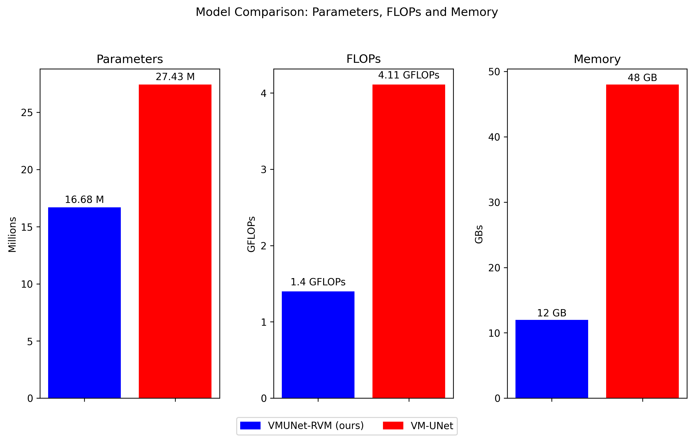

<div align="center">
<h1>VMUNet-RVM: Vision Mamba UNet with Residual Vision Mamba Layer for Medical Image Segmentation</h1>

[Mahmud Al Ashiq]()<sup>1</sup>,
[Nishat Afla]()<sup>1</sup>,
[Pranto Biswas]()<sup>1</sup>,
[Sumaiya Tasnim]()<sup>1</sup>,
[Abhijit Bhowmik]()<sup>1</sup>,
[Dip Nandi]()<sup>1</sup>,
[Mashiour Rahman]()<sup>1</sup>,
[Debajyoti Karmaker]()<sup>1</sup>

<sup>1</sup> Department of Computer Science, Faculty of Science & Technology, American International University- Bangladesh

Paper: Our manuscript is currently under peer review by [**Visual Computing for Industry, Biomedicine, and Art**](https://vciba.springeropen.com/)

</div>

# 📄 Abstract

<p align="justify">
In the field of medical image segmentation, models based on Convolutional Neural Networks (CNN) and Transformers often face challenges caused by high parameter counts and long computational times. However, Vision Mamba UNet (VM-UNet) architecture offers an efficient U-shape structure for segmentation with a promising approach to State Space Models (SSM). Yet this approach still suffers from an excessive parameter count of almost 30 million that leads to high computational inefficiencies. In this work, we propose a modified version of VM-UNet by introducing a Residual Vision Mamba (RVM) layer and compressing the VSS blocks, that effectively reduces the parameter count to 16 million. RVM layer extracts deep explanation features and models long-range input dependencies with linear computational complexity. We conducted extensive experiments using a diverse set of medical imaging datasets as well as portrait mating and saliency detection datasets. This contribution offers a more efficient approach without compromising performance.
</p>

# 📊 Model Efficiency Comparison
<p align="justify">
Our proposed VMUNet-RVM demonstrates significant computational efficiency improvements over the original <a href='https://arxiv.org/abs/2402.02491'>VM-UNet</a> architecture. As illustrated in the comparison above, VMUNet-RVM achieves a substantial reduction in model complexity while maintaining competitive performance: 

- **Parameters**: Reduced from 27.43M to 16.68M (39% reduction)
- **FLOPs**: Decreased from 4.11 GFLOPs to 1.4 GFLOPs (66% reduction)  
- **Memory Usage**: Lowered from 48GB to 12GB (75% reduction)
</p>
<div align="center">

</div>

# ⚙️ VMUNet-RVM Setup Guide

## 📋 Prerequisites

- Python 3.8
- CUDA 11.7 compatible GPU
- Conda package manager

## 🛠️ Environment Setup

### Create and Activate Environment

```bash
conda create -n vmunet-rvm python=3.8
conda activate vmunet-rvm
```

### Install Dependencies

```bash
# PyTorch and related packages
pip install torch==1.13.0 torchvision==0.14.0 torchaudio==0.13.0 --extra-index-url https://download.pytorch.org/whl/cu117

# Core dependencies
pip install packaging timm==0.4.12

# Development and testing tools
pip install pytest chardet yacs termcolor

# Training utilities
pip install submitit tensorboardX

# Specialized packages
pip install triton==2.0.0
pip install causal_conv1d==1.0.0
pip install mamba_ssm==1.0.1

# Scientific computing and image processing
pip install scikit-learn matplotlib thop h5py SimpleITK scikit-image medpy yacs
```

## 📁 Dataset Preparation

#### Directory Structure (except Synapse dataset)

After downloading, organize the datasets as follows:

```
./data/{dataset_folder}/
├── train/
│   ├── images/
│   │   └── *.png
│   └── masks/
│       └── *.png
└── val/
    ├── images/
    │   └── *.png
    └── masks/
        └── *.png
```

For Synapse Dataset

```
./data/Synapse/
├── lists/
│   └── list_Synapse/
│       ├── all.lst
│       ├── test_vol.txt
│       └── train.txt
├── test_vol_h5/
│   └── case****.npy.h5
└── train_npz/
    └── case****_slice***.npz
```

#### Download Links

- Medical Datasets:
  - Skin Lesion:
    - **ISIC 17**: [Download](https://challenge.isic-archive.com/data/#2017)
    - **ISIC 18**: [Download](https://challenge.isic-archive.com/data/#2018)
    - **PH2**: [Download](https://www.fc.up.pt/addi/ph2%20database.html)
    - **HAM10000 (HAM10K)**: [Download](https://dataverse.harvard.edu/dataset.xhtml?persistentId=doi:10.7910/DVN/DBW86T)
  - Polyp:
    - **Kvasir SEG**: [Download](https://datasets.simula.no/kvasir-seg/)
  - Lung Lesion:
    - **COVID-19 Lung CT Scan**: [Download](https://www.kaggle.com/datasets/maedemaftouni/covid19-ct-scan-lesion-segmentation-dataset)
  - Multi-organ:
    - **Synapse**: [Download](https://www.synapse.org/#!Synapse:syn3249110) or [Follow Swin-UNet](https://github.com/HuCaoFighting/Swin-Unet)
- Non-medical Datasets:
  - Portrait Matting:
    - **Privacy-Preserving Portrait Matting (P3M)**: [Download](https://github.com/JizhiziLi/P3M)
  - Saliency Detection:
    - **Extended Complex Scene Saliency Dataset (ECSSD)**: [Download](https://www.cse.cuhk.edu.hk/leojia/projects/hsaliency/dataset.html)
    - **DUTS**: [Download](https://saliencydetection.net/duts/#org1278077)
    - **DUT-OMRON**: [Download](https://saliencydetection.net/dut-omron/)

**The pre-processed datasets used in this work can be downloaded from the link:** [Google Drive](https://drive.google.com/file/d/1_GMsSxveqUMkLZpwXKt7lh2OCd4rhq8w/view?usp=sharing)

## 🔧 Pre-trained Weights

#### Download Pre-trained VMamba Weights

- **Official Repository**: [VMamba GitHub](https://github.com/MzeroMiko/VMamba)
- **Google Drive**: [Download](https://drive.google.com/drive/folders/1sIxZlOk-BlZcNcG8EzdjXR9z_p8O8gGL?usp=sharing)

#### Storage Location

Place the downloaded weights in:

```
./pretrained_weights/
```

## 🚀 Training

#### For Synapse Dataset

```bash
cd VM-UNet
python train_synapse.py
```

#### For Other Datasets

```bash
cd VM-UNet
python train.py
```

## 📊 Results

After training completion, find your results in:

```
./results/
```

## 👏 Acknowledgments

- We thank the authors of [VM-UNet](https://github.com/JCruan519/VM-UNet) for their open-source codes.

## 📞 Support & Contact

For any queries, issues, or assistance, please feel free to reach out: m.ashiqfida@gmail.com or [Linkedin](https://www.linkedin.com/in/mahmud-ashiq/)
